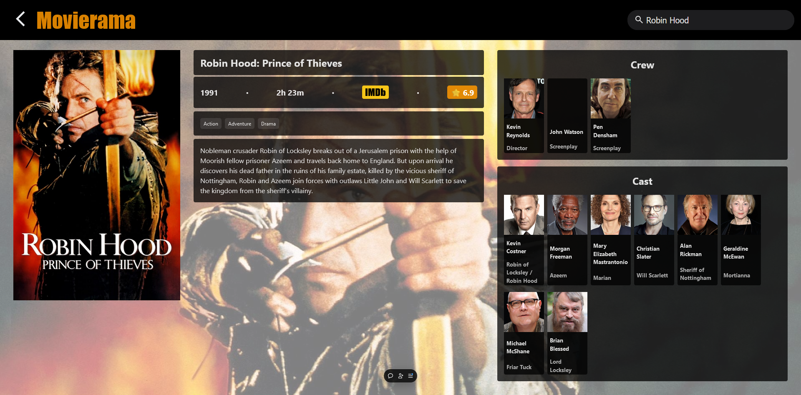
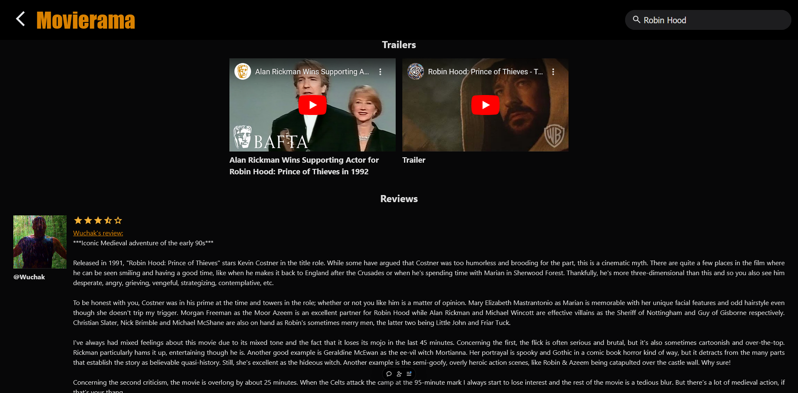
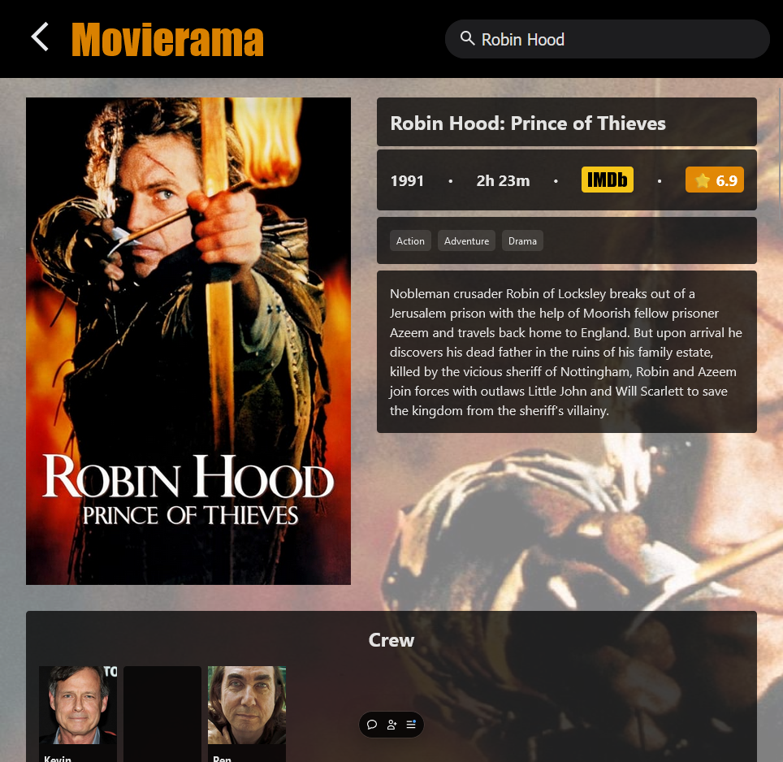
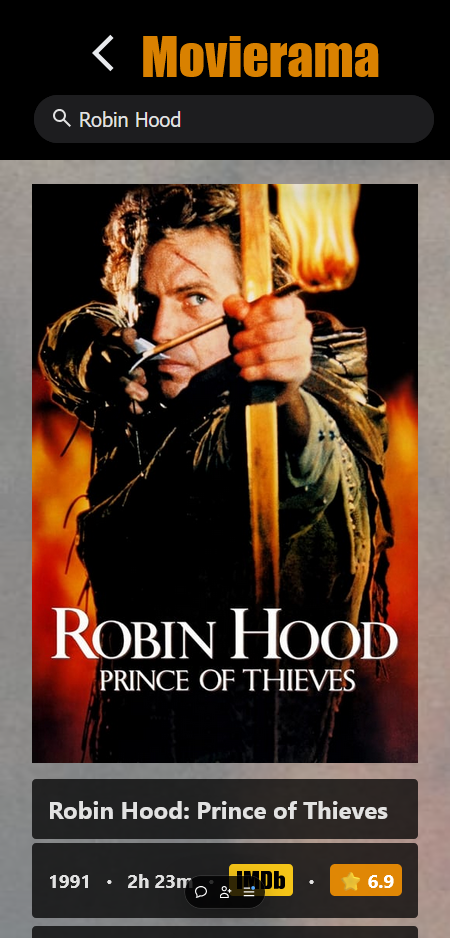
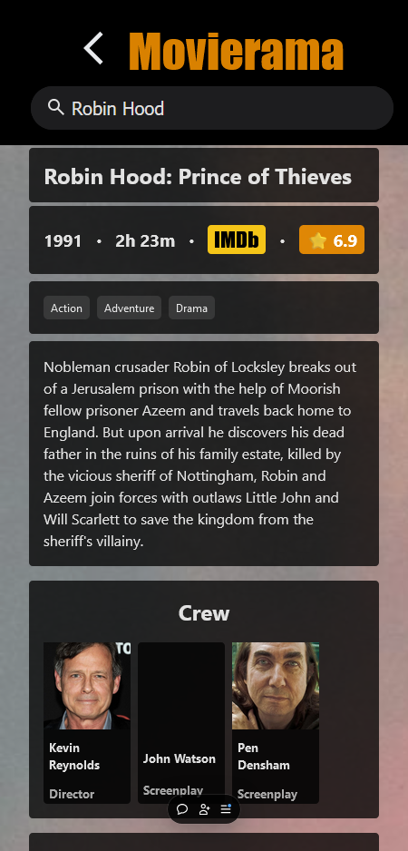
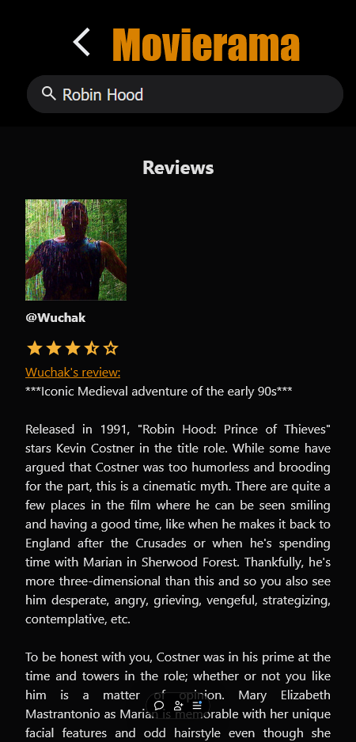

# Movierama (React)


## Table of Contents

- [Overview](#overview)
- [Features](#features)
- [Screenshots](#screenshots)
- [Responsive Design](#responsive-design)
- [Accessibility](#accessibility)
- [Installation](#installation)
- [Testing](#testing)
- [Contributing](#contributing)
- [License](#license)

## Overview

Movierama is a movie catalog app that allows users to browse through a wide range of movies, view detailed information about each movie, and watch trailers. The app leverages The Movie DB (TMDB) API to fetch movie data and display it in an intuitive and user-friendly interface. Users can explore the latest movies, search for specific titles, read reviews, and discover similar movies, all within a single platform. Movierama is built using TypeScript, React, and CSS, ensuring a seamless and engaging user experience across various devices and screen sizes.

## Features

- **In Theaters**: Find a list of movies currently being played in cinemas.
- **Movie Discovery**: Browse through a wide range of movies and explore detailed information about each movie, including overview, trailers, reviews, and ratings.
- **Keyword Search**: Type in the search bar to filter through TMDB's huge catalog of movies.
- **YouTube Trailers**: Find trailers and watch them right inside the app.
- **User Reviews**: Read user reviews for any movie.
- **Similar Movies**: Each movie has its own suggested list of similar movies.
- **Infinite Scrolling**: Just scroll down and the movies keep coming.
- **Responsive Design**: The app is designed to work seamlessly across various devices and screen sizes.
- **Accessibility**: The app uses `rem` units for better accessibility and scalability.
- **Dark Mode**: Automatically switches between light and dark themes based on the user's system preferences.

## Screenshots








|  |  |  |  |
|-------------------------------------------------------------|---------------------------------------------------------------|---------------------------------------------------------------|-------------------------------------------------------------|

## Responsive Design

The app is designed with responsiveness in mind, ensuring it delivers an optimal user experience across various devices and screen sizes. By utilizing responsive design techniques, such as flexible layouts, media queries, and scalable components, the interface adapts seamlessly to different resolutions, from mobile phones to desktop screens. This approach ensures that content remains accessible and easy to interact with, regardless of the user's device.

## Accessibility

The app employs `rem` units instead of pixels (`px`) to enhance accessibility and improve scalability. Unlike pixels, which are fixed units, `rem` units are relative to the root font size, typically set by the user’s browser settings. This allows users who adjust their default font size for better readability—such as individuals with visual impairments—to experience a more accessible interface. By using rem, the app's layout and text scale proportionally, ensuring that all elements remain legible and usable regardless of the user's device settings or personal preferences. This approach promotes a more inclusive user experience and aligns with best practices for responsive and accessible web design.

## Installation

To get started with Movierama, follow these steps:

1. Clone the repository: `git clone https://github.com/felagund1789/movierama-react.git`.
2. Run `npm install` to install the required dependencies.
3. Get a TMDB API key at [https://www.themoviedb.org/settings/api](https://www.themoviedb.org/settings/api). You'll have to create an account first.
4. Copy `.env.example` to `.env` and replace the value of `VITE_TMDB_API_KEY=YOUR_API_KEY` with your own key
5. Run `npm run dev` to start the web server.
6. Open your browser and visit `http://localhost:5173` to access Movierama.

## Testing

To run the tests, use the following command:

```bash
npm run test
```

To run the tests in UI mode, use the following command:

```bash
npm run test:ui
```

## Contributing

Contributions are welcome! If you have any ideas, suggestions, or bug reports, please open an issue or submit a pull request. Here's how you can contribute:

1. Fork the repository on GitHub.
2. Clone your forked repository to your local machine.
3. Create a new branch for your changes.
4. Make your desired changes to the codebase.
5. Commit and push your changes to your forked repository.
6. Submit a pull request to the original repository.

Please ensure that your contributions adhere to the project's coding conventions and guidelines. Also, make sure to provide a clear and detailed description of your changes in the pull request.

Thank you for your interest in contributing to Movierama!

## License

This project is licensed under the [MIT License](LICENSE).
